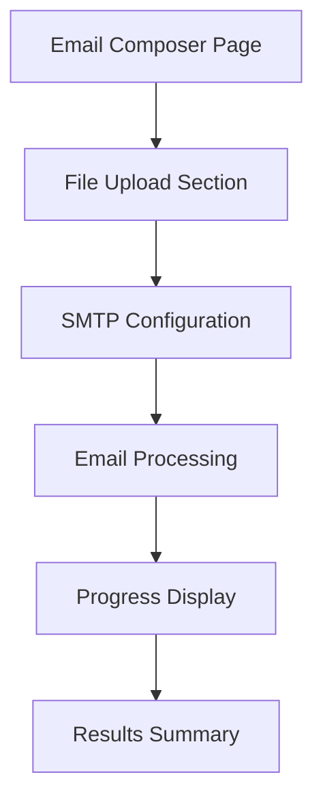

## 1. Product Overview
A web-based bulk email sender that allows users to send personalized emails to multiple recipients from uploaded CSV/XLSX files. Users can compose messages with dynamic placeholders and send emails through various email providers.

This tool solves the problem of manually sending personalized emails to large recipient lists, helping businesses and individuals automate their email communication with proper personalization.

## 2. Core Features

### 2.1 User Roles
| Role | Registration Method | Core Permissions |
|------|---------------------|------------------|
| Guest User | No registration required | Can compose and send bulk emails with session-based data |

### 2.2 Feature Module
The bulk email sender consists of the following main pages:
1. **Email Composer**: Form for composing emails with subject, message body, CC, and email account selection
2. **File Upload**: Interface for uploading recipient CSV/XLSX files
3. **SMTP Configuration**: Settings for email account credentials and server configuration
4. **Sending Progress**: Real-time status display showing email sending progress and results

### 2.3 Page Details
| Page Name | Module Name | Feature description |
|-----------|-------------|---------------------|
| Email Composer | Subject Input | Text input field for email subject line |
| Email Composer | Message Body | Textarea supporting {{name}} placeholder replacement |
| Email Composer | CC Field | Optional text input for carbon copy recipients |
| Email Composer | Email Account Selector | Dropdown to choose email provider (Gmail, Outlook, Custom SMTP) |
| File Upload | File Upload Area | Drag-and-drop or browse to upload CSV/XLSX files |
| File Upload | File Preview | Display uploaded file contents in table format |
| SMTP Configuration | SMTP Settings Form | Input fields for host, port, username, password, security type |
| Sending Progress | Progress Bar | Visual indicator showing email sending progress |
| Sending Progress | Status Table | Real-time table showing recipient name, email, status, and errors |
| Sending Progress | Success Summary | Final message with total sent/failed count |

## 3. Core Process
User Flow:
1. User lands on the main page and sees the email composer form
2. User fills in email subject and message body with {{name}} placeholder
3. User optionally adds CC recipients
4. User selects email provider from dropdown
5. User uploads CSV/XLSX file containing recipient data
6. System validates and displays uploaded data
7. User configures SMTP settings if custom provider selected
8. User initiates email sending process
9. System processes each row, replaces placeholders, and sends emails
10. Real-time progress updates show sending status for each recipient
11. Final summary displays total success/failure count

## 4. User Interface Design

### 4.1 Design Style
- Primary color: Blue (#3B82F6) for primary actions and headers
- Secondary color: Gray (#6B7280) for secondary elements
- Button style: Rounded corners with hover effects
- Font: System fonts (Inter, sans-serif) with 16px base size
- Layout style: Card-based layout with proper spacing
- Icons: Bootstrap Icons for file upload, email, and status indicators

### 4.2 Page Design Overview
| Page Name | Module Name | UI Elements |
|-----------|-------------|-------------|
| Email Composer | Subject Input | Rounded text input with blue border focus, full width |
| Email Composer | Message Body | Large textarea with placeholder hint, 200px minimum height |
| Email Composer | CC Field | Optional text input with email validation indicator |
| Email Composer | Account Selector | Dropdown with provider icons and descriptions |
| File Upload | Upload Area | Dashed border drag zone with file type icons |
| File Upload | Preview Table | Striped table with scrollable container for large datasets |
| SMTP Configuration | Settings Form | Grouped input fields with inline validation |
| Sending Progress | Progress Bar | Animated blue progress bar with percentage display |
| Sending Progress | Status Table | Color-coded status badges (green for success, red for failed) |

### 4.3 Responsiveness
Desktop-first design approach with mobile responsiveness:
- Full-width layout on desktop (1200px max container)
- Stacked layout on mobile with proper spacing
- Touch-friendly buttons and form elements
- Responsive tables with horizontal scroll on mobile
- Collapsible sections for better mobile experience