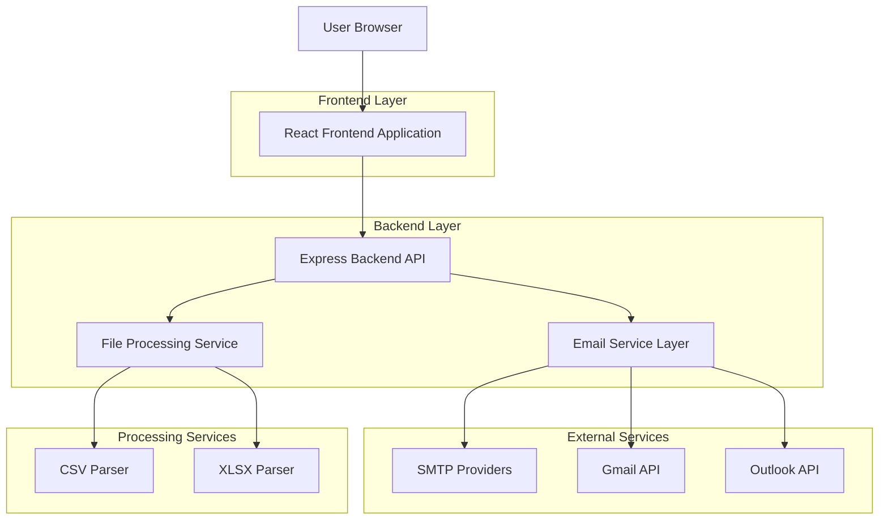
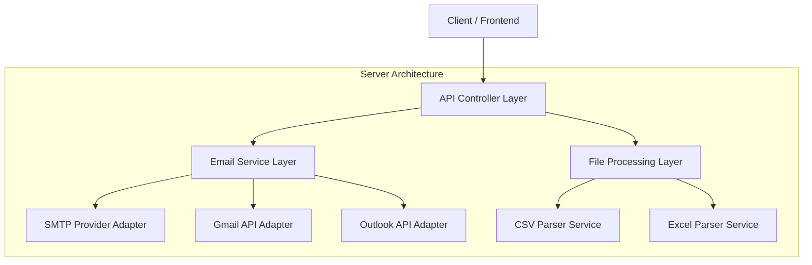
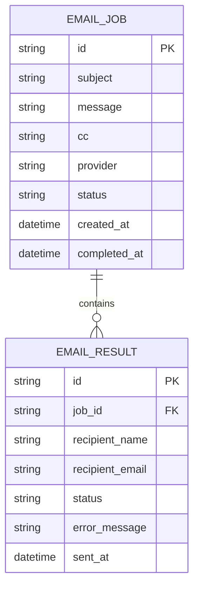

## 1. Architecture design



## 2. Technology Description

- Frontend: React@18 + tailwindcss@3 + vite
- Backend: Node.js@18 + Express@4
- Email Libraries: nodemailer@6 for SMTP, googleapis@126 for Gmail API
- File Processing: papaparse@5 for CSV, xlsx@0.18 for Excel files
- Additional: cors@2, multer@1 for file uploads, dotenv@16 for environment variables

## 3. Route definitions

| Route | Purpose |
|-------|---------|
| / | Main page with email composer form |
| /upload | File upload endpoint for CSV/XLSX processing |
| /send-emails | Email sending endpoint with bulk processing |
| /smtp-config | SMTP configuration validation endpoint |
| /status/:jobId | Real-time status check for email sending jobs |

## 4. API definitions

### 4.1 Core API

**File Upload Processing**
```
POST /api/upload
```

Request (multipart/form-data):
| Param Name| Param Type  | isRequired  | Description |
|-----------|-------------|-------------|-------------|
| file      | File        | true        | CSV or XLSX file containing recipients |

Response:
| Param Name| Param Type  | Description |
|-----------|-------------|-------------|
| success   | boolean     | Upload status |
| data      | array       | Array of {name, email} objects |
| message   | string      | Status message |

**Bulk Email Sending**
```
POST /api/send-emails
```

Request:
| Param Name| Param Type  | isRequired  | Description |
|-----------|-------------|-------------|-------------|
| subject   | string      | true        | Email subject line |
| message   | string      | true        | Message body with placeholders |
| cc        | string      | false       | CC email addresses |
| provider  | string      | true        | Email provider type |
| recipients| array       | true        | Array of recipient objects |
| smtpConfig| object      | conditional | Required for custom SMTP |

Response:
| Param Name| Param Type  | Description |
|-----------|-------------|-------------|
| jobId     | string      | Unique identifier for tracking |
| status    | string      | Job status (processing, completed, failed) |
| results   | array       | Individual email sending results |

## 5. Server architecture diagram



## 6. Data model

### 6.1 Data model definition



### 6.2 Data Definition Language

**Email Jobs Table**
```sql
-- In-memory storage for job tracking (can be replaced with database)
const emailJobs = new Map();

// Job object structure
{
  id: 'uuid',
  subject: 'string',
  message: 'string', 
  cc: 'string',
  provider: 'gmail|outlook|smtp',
  status: 'pending|processing|completed|failed',
  recipients: [
    {
      name: 'string',
      email: 'string',
      status: 'pending|sent|failed',
      error: 'string'
    }
  ],
  createdAt: Date,
  completedAt: Date
}
```

**Email Configuration Storage**
```javascript
// Environment variables for email providers
const emailConfig = {
  gmail: {
    clientId: process.env.GMAIL_CLIENT_ID,
    clientSecret: process.env.GMAIL_CLIENT_SECRET,
    redirectUri: process.env.GMAIL_REDIRECT_URI
  },
  smtp: {
    host: process.env.SMTP_HOST,
    port: process.env.SMTP_PORT,
    secure: process.env.SMTP_SECURE,
    user: process.env.SMTP_USER,
    pass: process.env.SMTP_PASS
  }
};
```